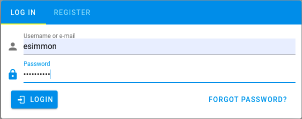

Requirements
------------

This following packages needs to be installed inorder to bring up the eSimMon stack:

- [docker](https://docs.docker.com/) - install instructions can be found [here](https://docs.docker.com/engine/install/)
- [docker-compose](https://docs.docker.com/compose/) - install instructions can be found [here](https://docs.docker.com/compose/install/)


Outline of Services
-------------------
Bringing up the stack will create a series of Docker containers that allow the use of the eSimMon Dashboard, and each container supports a role in that process.

- ```docker-compose.girder.yml``` - Data management platform that uses MongoDB to store and retrieve data.
- ```docker-compose.ansible.yml``` - Ansible playbook to setup the Girder instance. The playbook will create two users (one with admin rights), an assetstore for storage, a collection for the data, a folder within that collection that will be the default location to upload the data to (this can be changed with the ```GIRDER_FOLDER_ID``` discussed in the section below), and the API key that the ```watch``` container will need.
- ```docker-compose.client.yml``` - Builds the client application and uses NGINX to make the app available on ```localhost:9090```.
- ```docker-compose.watch.yml``` - Runs a Python script to watch the simulation assets site (where the data is being hosted) and upload that data to Girder as it comes in.
- ```docker-compose.movie.yml``` - A Flask service that uses FFmpeg to create movies of the selected parameter's data, then downloads them to the local machine.
- ```docker-compose.demo.yml``` - A static simulation assets site that has been pre-populated with sample data and can be used as a simple way to populate and interact with the dashboard. This is set to be the default ```UPLOAD_SITE_URL```, which is what the ingest script in the ```watch``` container will watch for new data.


Setting up the environment variables
------------------------------------
To setup the Girder instance two users are created: ```esimmonadmin``` and ```esimmon```. The passwords for these users must be set in the ```.env``` file located in ```eSimMon/devops/docker``` under the ```ADMIN_PASSWORD``` and ```ESIMMON_PASSWORD``` keys. Optionally, if a Girder instance has already been built the ```GIRDER_API_KEY``` and ```GIRDER_FOLDER_ID``` can be set in the ```watch.env``` file located in the same directory. If the keys are not set, they will be created automatically when the Girder instance is created. Changing the ```GIRDER_FOLDER_ID``` will change the location that files are uploaded to with the ingest script. The ```watch.env``` file also contains the ```UPLOAD_SITE_URL```, which should be set to the simulation assets url.


Create and setup the Girder instance
------------------------------------
To create the Girder instance, you will need to have set the ```ADMIN_PASSWORD``` and ```ESIMMON_PASSWORD``` keys mentioned above, then run the following command:

    cd <repo>/devops/docker
    docker-compose -p esimmon -f docker-compose.girder.yml -f docker-compose.ansible.yml up

If successfull it will return ```esimmon_ansible_1 exited with code 0```, after which you can use ```ctrl-c``` to bring down the stack. This should only need to be run once for the initial setup. If the Girder database is removed and the setup needs to be re-run, the ```GIRDER_FOLDER_ID``` and ```GIRDER_API_KEY``` keys will need to be reset if they are not being manually set by the user. This can be done by running the following:

```git checkout -- <repo>/devops/docker/watch.env```


Bringing up the monitoring code
------------------------------
When the ```docker-compose.watch.yml``` file is included in the ```docker-compose``` command and the ```UPLOAD_SITE_URL``` has been set in the ```watch.env``` file, any existing run data will be ingested and any runs in progress will continue to populate the database as steps are completed. When the initial data has been ingested the watch script will continue to run, but you will know all existing data has been completely uploaded when you see the following:

```watch_1    | [date] [time] - adash - INFO - Fetching /shots/index.json```

This message will appear once every minute as the script continues to watch for new timesteps that may have been added.


Bringing up the stack
---------------------
To bring up the stack each time run the following command:

    cd <repo>/devops/docker
    docker-compose -p esimmon \
    -f docker-compose.client.yml \
    -f docker-compose.girder.yml \
    -f docker-compose.movie.yml \
    -f docker-compose.watch.yml \
    -f docker-compose.demo.yml up

The ```docker-compose.demo.yml``` file is optional and only needs to be included if you would like to use the sample data. The dashboard will then be exposed on ```localhost:9090```. When you access the dashboard you will see the login prompt, which is where you will enter the ```esimmon``` username and ```ESIMMON_PASSWORD``` set in the ```.env``` file.



Once you have logged in, the dashboard should look like the following:


Bringing down the stack
-----------------------
    docker-compose -p esimmon \
    -f docker-compose.client.yml \
    -f docker-compose.girder.yml \
    -f docker-compose.movie.yml \
    -f docker-compose.watch.yml \
    -f docker-compose.demo.yml down
