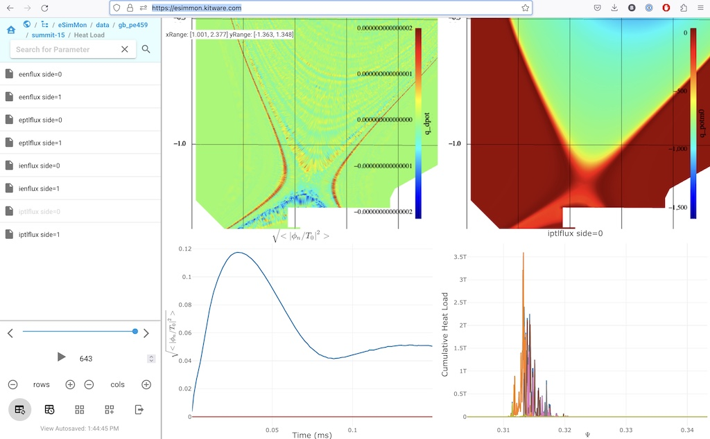

eSimMon
-------

eSimMon is Web application for managing and visualization data extracts
generated through analysis and visualization of simulation results. Data
extracts supported by eSimMon include:

- 1D line charts (rendered using plotly)
- 2D plots (rendered using vtk.js)
- 2D mesh plots (rendered using vtk.js)
- images

Data extracts can be generated by the workflow tool [EFFIS](https://github.com/wdmapp/effis) and the in situ library [ParaView Catalyst](https://paraview.org). A Python library to generate/convert data extracts is also in progress.

See the [full documentation](https://esimmon.readthedocs.io) for detailed on information for users and developers.
