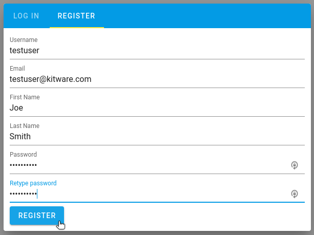
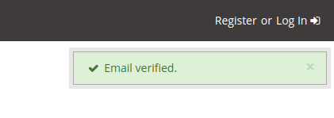

# Accessing Deployed Dashboard

Navigate to [https://esimmon.kitware.com/](https://esimmon.kitware.com/) to access the deployed dashboard. You will be prompted to log in if you have not already. See the steps below for new users that do not yet have an account.

## Create a new user account
----------------------------

1. Select the `Register` tab and create an account. To restrict access to the dashboard and its data, users are limited to those with a `ornl.gov`, `princeton.edu`, or `kitware.com` domain at this point.

    

2. Wait for a verification email and then follow the provided link. You should get a notification in the upper right of the page that you are directed to that tells you your account has succesfully been verified. If you do not see an email check your spam folder.

    

3. Wait for admin approval. You will be notified via email once your account has been approved.

## Navigating the dashboard
---------------------------

### Directories and folders

To navigate down the tree... (folder vs item icon)
To navigate up the tree...
View more data (rows per page, next/prev page)

### Viewing data

Drag and drop items
Add rows/columns
Play/Pause, step forward/back
Interacting with a plotly plot
Hovering over item will display data range
Nav bar can be grown/shrunk
Logout button

### Searching for data

Recursively searches current directory and all its children
Move to top level (eSimMon Dashboard folder) for broadest search
Multiple matches are listed w/full paths if found
Enter or search icon

### Downloading movies

Right-click on item in nav bar
Right-click on plot itself
Will include all available steps? Or just visible ones at time of request?
