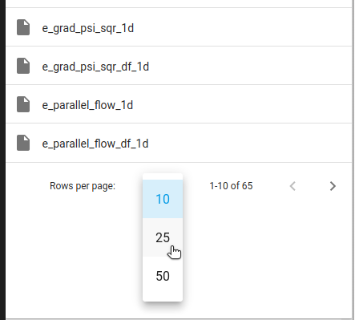
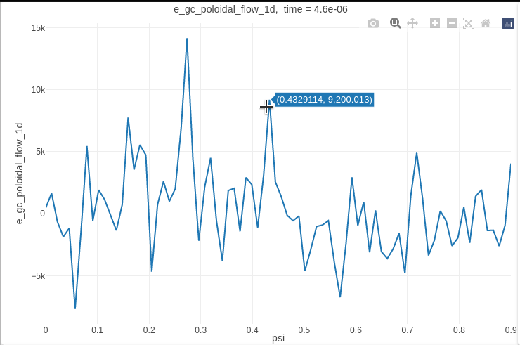
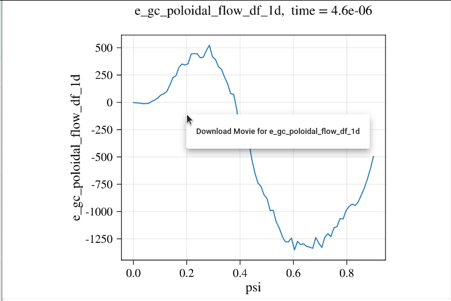

# Viewing Data

## Directory Navigation
### Moving up and down the tree
Directories can be navigated through by clicking on an option in the navigation bar on the right side of the screen. To move back up the tree to a previous location simply select the location (or its parent) from the list of previous locations in the breadcrumbs at the top.


### Searching
The search feature is currently only available within the `eSimMon-dashboard` directory within the `eSimMon` collection. This is the top level directory for the dashboard and is the location that you start at when first navigating to the page.

As you begin searching the drop-down menu will update with options that match your search.


A single item can be selected from the menu or you can press enter or click the magnifying glass icon to return matching results. If there are multiple items that match the results will be prepended with their full path in order to make it easier to differentiate between the options. Clearing the search bar will return you to the previous location.

## Item Selection
### Displaying data
By default only 10 items are displayed at a time but this can be changed at the bottom of the navigation menu.



To display multiple plots at once use the `+` and `-` arrows to add or remove rows or columns. Items can be dragged and dropped into any of the cells. Cells with plots currently displayed will be replaced with the newest selection.


If the plot being displayed is a dynamic Plotly plot its data range for the current step can be viewed by hovering over the item name.


### Playing steps
When an item is dropped into a cell the available plots will begin playing, displaying the next time step every second. This can be paused, resumed, or stepped through manually at the bottom of the navigation menu. When left playing the plots will continue to update as new data is ingested.


## Interacting with Plots
### Plotly
In addition to adding the `dashboard` top-scope section users will need to add a `plot-1D` section under `run` in their configuration file if they wish to generate interactive Plotly plots.


```bash
plot-1D:
    x: psi
    data: xgc.diagnosis.1d
    output: plotly
```

If `output` is omitted the generated plots will be static images. This option is currently only available for 1D data.

When an interactive plot is displayed in the dashboard the user is able to hover over the plot to see data values, zoom in or out of a selected region, toggle the way data is displayed on hover, and download the image as a `png` file. The toolbar that appears in the upper right corner allows you to select the different options.



### Movies
For static images a movie of all of the available time steps can be downloaded by right-clicking on either the plot itself or the item name in the naviagation menu.


