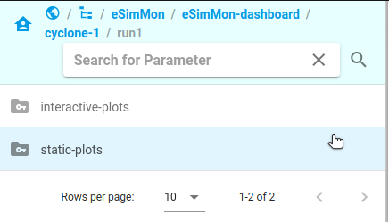
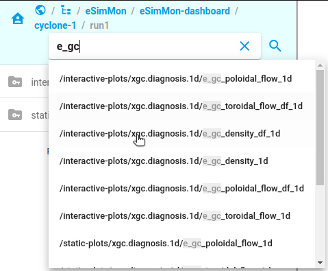
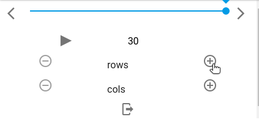
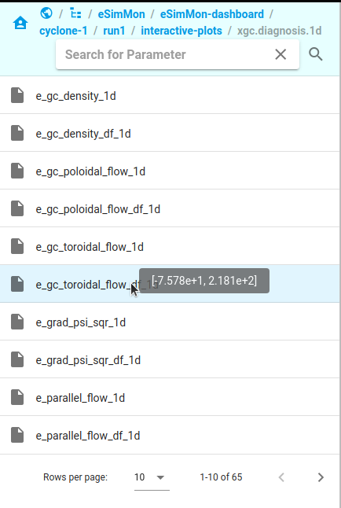
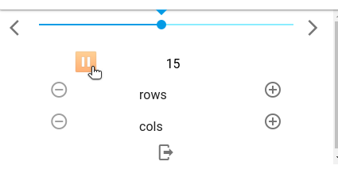
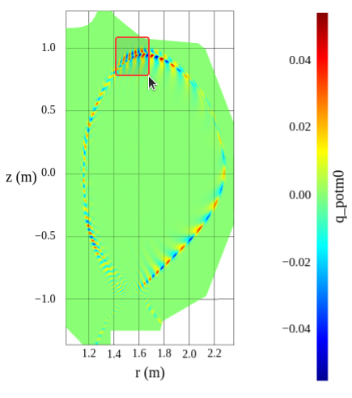
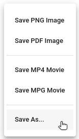
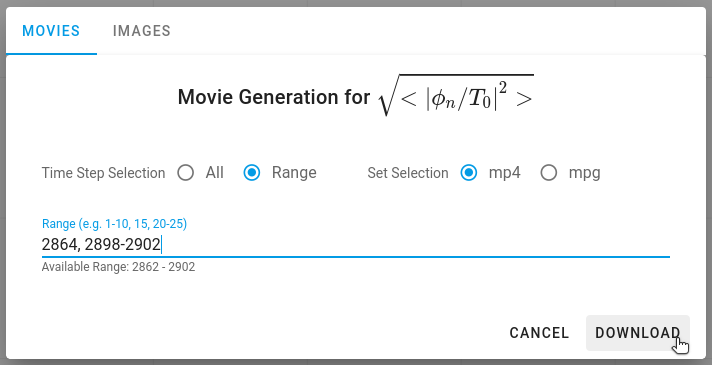
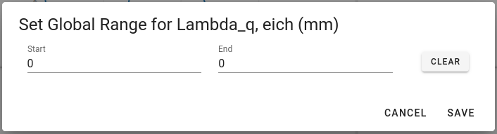

# Using the Dashboard

## Directory Navigation
### Moving up and down the tree
Directories can be navigated through by clicking on an option in the navigation bar on the right side of the screen. To move back up the tree to a previous location simply select the location (or its parent) from the list of previous locations in the breadcrumbs at the top.

{style="display: block; margin: 0 auto"}

### Searching
The search feature is currently only available within the `eSimMon-dashboard` directory within the `eSimMon` collection. This is the top level directory for the dashboard and is the location that you start at when first navigating to the page.

As you begin searching the drop-down menu will update with options that match your search.

{style="display: block; margin: 0 auto"}

A single item can be selected from the menu or you can press enter or click the magnifying glass icon to return matching results. If there are multiple items that match the results will be prepended with their full path in order to make it easier to differentiate between the options. Clearing the search bar will return you to the previous location.

## Item Selection
### Displaying data
To display multiple plots at once use the `+` and `-` arrows to add or remove rows or columns. Items can be dragged and dropped into any of the cells. Cells with plots currently displayed will be replaced with the newest selection.

{style="display: block; margin: 0 auto"}

If the plot being displayed is a interactive Plotly plot its data range for the current step can be viewed by hovering over the item name.

{style="display: block; margin: 0 auto"}

### Playing steps
When an item is dropped into a cell the available plots will begin playing, displaying the next time step every second. This can be paused, resumed, or stepped through manually at the bottom of the navigation menu. When left playing the plots will continue to update as new data is ingested.

{style="display: block; margin: 0 auto"}

## Interacting with Plots
### Interactive Plots
Plots currently come in two varieties: either Plotly plots (for one dimensional plots) or VTK.js plots (for more two dimensional plots). Either type can be zoomed by clicking and dragging to select the region of interest.

{style="display: block; margin: 0 auto"}

The 1D Plotly plots currently offer a few additional options, available through the mode bar when the animation is paused. Users can toggle the way data is displayed on hover, pan around the plot, and apply or remove log scaling.

{style="display: block; margin: 0 auto"}

Support for equivalent features across VTK.js plots is currently in progress.

### Movies and Images
Right clicking a plot will provide a list of options for saving the data either as a seperate images for each selected time step or as a single movie for multiple time steps.

{style="display: block; margin: 0 auto"}

Selecting `Save PNG Image` or `Save PDF Image` will download a single image of the selected format for the current time step. Selecting `Save MP4 Movie` or `Save MPG Movie` from the menu will download a movie for the selected parameter in the chosen format. The movie will include all availble time steps for that parameter.

The `Save As..` choice offers a selection of avanced options for both movies and images.

{style="display: block; margin: 0 auto"}

At the top of the dialog is the option to toggle between either movie or image downloads. From there you can select either `All` or `Range` for the time steps as well as the download format.

For movie generation selecting `All` or `Range` will simply determine which time steps are included in the movie. For image download selecting `All` or `Range` will download all selected time steps at once as a zipped directory.

There is a hint provided underneath the range input that indicates the smallest and largest acceptable time step for the given parameter. Users are warned if the values or format they've input for the range is invalid.

### Global Data Range
For 1D Plotly plots right-clicking on the plot will also display an additonal option: `Set global range for {current parameter}`. Selecting this option will allow the user to set the y-axis range for all timesteps for the selected parameter. Selecting `Clear` and then saving the range will reset the axis to the default behavior of resizing based on the current timestep range.

{style="display: block; margin: 0 auto"}
