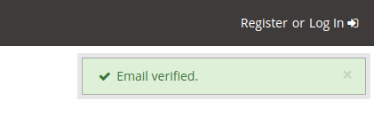

# Accessing Deployed Dashboard

Navigate to [https://esimmon.kitware.com/](https://esimmon.kitware.com/) to access the deployed dashboard. You will be prompted to log in if you have not already. See the steps below for new users that do not yet have an account.

## Create a new user account
----------------------------

1. Select the `Register` tab and create an account. To restrict access to the dashboard and its data, users are limited to those with a `ornl.gov`, `princeton.edu`, or `kitware.com` domain at this point.

    

2. Wait for a verification email and then follow the provided link. You should get a notification in the upper right of the page that you are directed to that tells you your account has succesfully been verified. If you do not see an email check your spam folder.

    

3. Wait for admin approval. You will be notified via email once your account has been approved.

4. The email verification will direct you to the Girder homepage. To access the dashboard you will need to navigate back to [https://esimmon.kitware.com/](https://esimmon.kitware.com/).