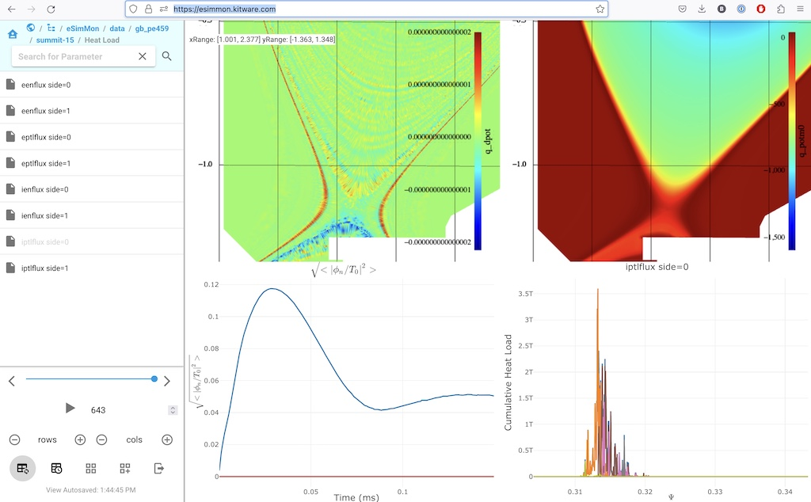

# eSimMon

eSimMon is Web application for managing and visualization data extracts
generated through analysis and visualization of simulation results. Data
extracts supported by eSimMon include:

- 1D line charts (rendered using plotly)
- 2D plots (rendered using vtk.js)
- 2D mesh plots (rendered using vtk.js)
- images

Data extracts can be generated by the workflow tool [EFFIS](https://github.com/wdmapp/effis)
and the in situ library [ParaView Catalyst](https://paraview.org). A Python library to
generate/convert data extracts is also in progress. Once generated, these extracts are
then uploaded to the eSimMon database and can then be immediately displayed making eSimMon
a convenient tool for monitoring the results of simulations in progress.

Each eSimMon dashboard offers limited access control where all authorized users are able
to access all of the data extracts. Therefore, we recommend that a separate instance
is deployed for each simulation community that would like to share the results from their
simulations runs.

NEED EXAMPLE DASHBOARDS HERE. DOCKER IMAGES?
