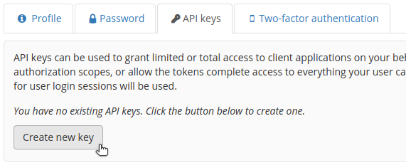
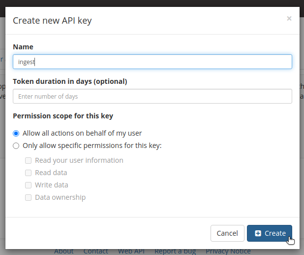
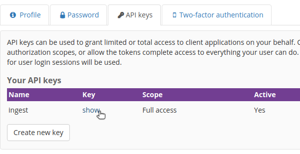

# Ingesting Data

## Running with the monitoring service with EFFIS data
------------------------------------------------------

### Run local ingest script

#### Clone

```bash
git clone git@github.com:Kitware/eSimMon.git
```

#### Install

```bash
pip install -e <eSimMon-dashboard-repo>/ingest
```

#### Run the watch ingester

```bash
adash watch -f 5eb01cc71eba106544dc5270 -r <url-to-data> -k <girder-api-key> -u https://api.esimmon.kitware.com/api/v1 -v 5
```

- **`url-to-data`**: This will point to where the data is. See the instructions in the EFFIS [Read the Docs](https://wdmapp.readthedocs.io/en/latest/effis/dashboard.html) for enabling the dashboard. From the documentation example given the following http key:

        dashboard:
            http: /ccs/wwwproj/phy122/esuchyta/wdmapp-dashboard/shots

    The url-to-data would be:

        https://projects.olcf.ornl.gov/phy122/esuchyta/wdmapp-dashboard


- **`girder-api-key`**: This will varyu from user to user.
    1. Visit [https://api.esimmon.kitware.com/](https://api.esimmon.kitware.com/) and log in.

        

    2. Select `My Account` from the drop-down menu in the upper right hand corner.
    
        

    3. Navigate to the `API keys` tab and select `Create new key`. This only needs to be done once.

        

    4. Enter a name for the key and leave the token duration field empty and leave the `Allow all actions on behalf of my user` option selected, the press `Create`.

        

    5. Select `show` under the key column and then copy the key that is displayed. Keep this information safe and private.

        

### Automatic ingest

Not yet available