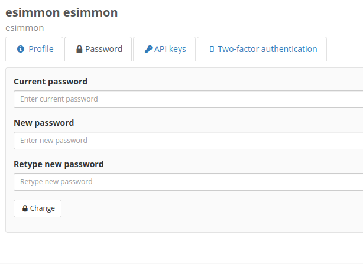

# Find your Deployment

We currently host dashboard deployments at [NERSC](https://app.esimmon.production.svc.spin.nersc.org/) and on [AWS](https://esimmon.kitware.com/). Please note that these are two separate instances and accounts and data on one dashboard are not available on the other.

## Create an Account
--------------------

1. Select the `Register` tab and create an account1.

    {style="display: block; margin: 0 auto"}

2. Account creation should be almost instantaneous and you should be automatically logged in on completion.

1*Please note*: In order to restrict access to the dashboard and its data, there is a group account that has access to the data after registration. Only users with a `ornl.gov`, `princeton.edu`, or `kitware.com` domain are automatically added at this point. If you create an account and are able to login but are unable to view any data or do not have an email account registered with the limited domains please reach out to <brianna.major@kitware.com>.

### Login

When you first navigate to the dashboard you will be prompted to login with the username and password you selected on account registration.

{style="display: block; margin: 0 auto"}

### Logout

You will remain logged into the dashboard on your next visit unless you explicitly logout. Use the cog wheel at the bottom of the navigation panel to open the settings panel. The logout button is located at the top.

{style="display: block; margin: 0 auto"}

## Account Management
---------------------

For further account management you can visit the [NERSC Girder instance](https://girder.esimmon.production.svc.spin.nersc.org/) or the [AWS Girder instance](https://api.esimmon.kitware.com/) and log in with the account that you created for the dashboard.

Once you are logged in you can navigate to `My Account` using the drop-down menu in the upper-right corner.

{style="display: block; margin: 0 auto"}

### Profile Information

The `Profile` tab will have all of your account information and you are able to easily update your email or correct your name if you would like to. Simply update the text field and click `Save`.

### Password

Use the `Password` tab to change your password if needed. Changes will not be saved until you select `Change`.

### Two-factor Authentication

Add an extra layer of security to your account by enabling two-factor authentication.

