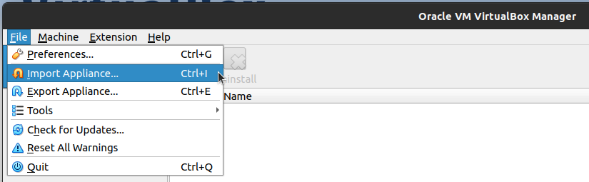
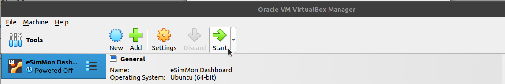
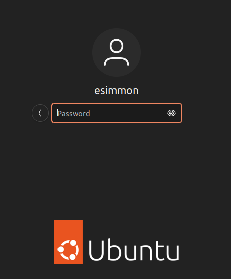
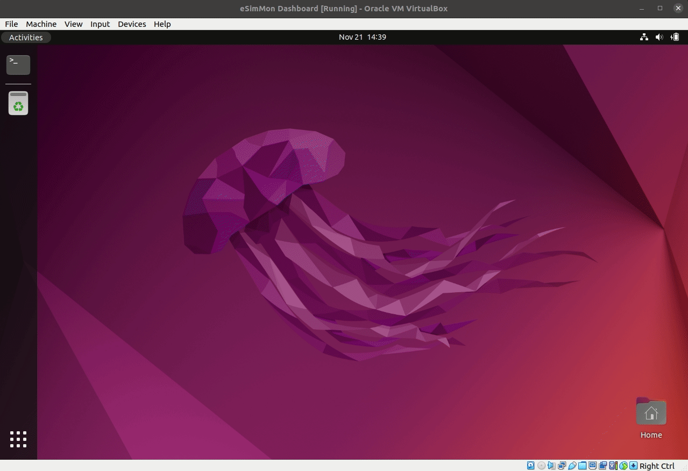
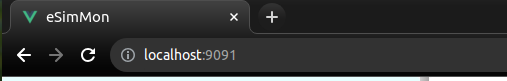

# Demo Dashboard
----------------

If you would like a simple, fast way to investigate the dashboard locally we provide a VirtualBox appliance with everything installed and set up for simple experimentation.

## Requirements

- [VirtualBox](https://www.virtualbox.org/wiki/Downloads) for your platform
- The [ova](https://data.kitware.com/api/v1/item/656795b2c5a2b36857ad181d/download) archive file (~10 GB)

## Setup

1. Launch Oracle VM VirtualBox and navigate to `File > Import Appliance` to begin the import.

{style="display: block; margin: 0 auto"}

2. Select the `.ova` file that you downloaded and click `Next`.
3. You should be able to keep all of the default settings and complete the process with `Finish`. The import will begin automatically and may take a few minutes to complete.

## View the Dashboard

1. Start the VM - either double-click on `eSimMon Dashboard` on the left-hand side under the tools, or select `eSimMon Dashboard` and select `Start` from the toolbar at the top.

{style="display: block; margin: 0 auto"}

2. Log into the VM with the password `letmein`.

{style="display: block; margin: 0 auto"}

3. Open the terminal and run the startup script

```bash
./start_dashboard
```

{style="display: block; margin: 0 auto"}

4. On your local machine navigate to <http://localhost:9091>

{style="display: block; margin: 0 auto"}

5. Log into the dashboard with the default credentials

```
User Name: esimmon
Password: letmein
```

{style="display: block; margin: 0 auto"}

6. Enjoy! Approximately 35 samples have been provided to get you started. Add cells and drag-and-drop plots to begin viewing data. See the [Navigating the Dashboard](../data.md) documentation for detailed information on changing settings and creating the perfect view!
