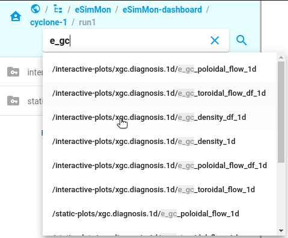
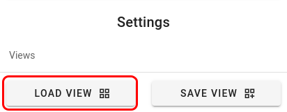

# Data

After data has been moved to the appropriate end point, that deployment's watch script will automatically ingest the data and it will be made available in the navigation panel on the right of the screen.

## Navigating the Tree
----------------------

To open folders and navigate through their contents click the name of the directory in the panel.

{style="display: block; margin: 0 auto"}

### Directory Structure

The top-most level of folders will be all of the available simulations and within each simulation will be the runs that are associated with it. Each run can then contain one or more categories of data, and each of these categories will contain all of the relevant variables that can be plotted.

### Breadcrumbs

The `breadcrumbs` are the links at the very top of the navigation panel that represent the path to your current location. You can navigate back up the directory tree by selecting one of these options.

{style="display: block; margin: 0 auto"}

## Searching
------------

The search will allow you to quickly locate data within the `eSimMon` collection. As you begin searching the drop-down menu will update with options that match your search.

{style="display: block; margin: 0 auto"}

A single item can be selected from the menu or you can press enter or click the magnifying glass icon to return matching results. If there are multiple items that match the results will be prepended with their full path in order to make it easier to differentiate between the options. Clearing the search bar will return you to the previous location.

## Settings
-----------

The settings panel can be found by clicking the cog wheel at the bottom of the navigation panel. This panel will allow you to toggle different UI options on and off as well as save and load views and logout of the application. Changes made here are global, meaning that all plots will be updated accordingly. For per-plot options see the [context menu](#context-menu) section.

### Views

While setting up the dashboard users may find that they have a selection of variables that they would like to come back to or that others may find useful to quickly load as well. On these occassions all of the current data (layout, variables, zoom, scaling, etc.) can be saved as a `View`. A saved `View`, along with any others that have been made public by other users, can then be selected from a list and will automatically populate the image gallery.

For a detailed breakdown see the [Views](#views) section of the documentation.

### Tools

#### Sync Animation

###### *Default: Off*
###### *Affects: All plot types*

Force animated time steps to stay synchronized.

Depending on the number of plots and the size of the data this may slow down the animation.

To play through all time steps quickly this option can be toggled off. This means that once a plot has loaded it will progress on to its next available time step and that each plot displayed may be on a different time step at any given point.

Currently this mode can only be toggled before any data has been loaded. To reset the view in order to toggle the mode remove all rows and columns and [use the context menu](#clear-plot) to clear the remaining plot if there is one.

#### Sync Zoom

###### *Default: On*
###### *Affects: All plot types*

Synchronize zoom behavior.

When toggled on all plots that share the same x-axis variable will be zoomed into the same region. Double-click will reset the view for all affected plots.

When toggled off on the selected plot will zoom.

#### Time Step Selection

###### *Default: Off*
###### *Affects: 1-D Plots*

Jump to time step for plot point.

For time-based plots you can quickly jump to a selected time step by double-clicking a point on the plot. When this is enabled zoom reset (also double-click) will be disabled. Once the point has been selected this option will automatically be turned off again and zoom reset will be re-enabled.

### UI

These are options that affect the way that you interact with the UI.

#### Auto-Save Prompt

###### *Default: On*

Enable or disable the load auto-save prompt.

When you are within a run and creating a layout that you like your selections will be auto-saved every 30 seconds. This allows re-loading your data if you accidentally lose those changes (closing the window, refreshing the page, etc.). Every time that you navigate into a run that has an auto-saved `View` available you will be prompted to either reload that `View` or ignore it and create something new.

Sometimes this dialog can be unnecessary though, especially if you are just browsing data and moving in and out of multiple runs. To temporarily hide this dialog turn this toggle off.

### Plots

These settings affect the way that plots are actually displayed. Any options selected here are global settings and will affect the appearance of all of the plots.

#### X-Axis

###### *Default: Off*
###### *Affects: All plot types*

Show or hide the x-axis label.

#### Y-Axis

###### *Default: Off*
###### *Affects: All plot types*

Show or hide the y-axis label.

#### Scalar Bar

###### *Default: Off*
###### *Affects: 2-D plots*

Show or hide the scalar bar legend.

#### Title

###### *Default: On*
###### *Affects: All plot types*

Show or hide the title label.

#### Legend

###### *Default: Off*
###### *Affects: 1-D plots*

Show or hide the plot legend.

#### Global Values

###### *Default: On*
###### *Affects: All plot types*

Use the global min/max for a run.

When a variable is ingested the overall min and max values are tracked and can be applied to all time steps. This prevents shifting axes over time.

When turned off the plots are auto-scaled to the current time step's data range.

#### Range Info

###### *Default: On*
###### *Affects: All plot types*

Show or hide range annotation text.

When an axis or scalar bar visibility is turned off the min and max for that data is displayed as a text annotation at the top of the plot. This information can be hidden if preferred.

Only hidden data is listed in this annotation. There is currently no option to show values for a visible axis.

#### Step Text

###### *Default: On*
###### *Affects: All plot types*

Show or hide the text annotation in the lower-right corner of each plot that indicates the time step that that particular plot is currently displaying.

## Views
-------

### Save View

To save a view open the settings panel and select `Save View`.

{style="display: block; margin: 0 auto"}

You will be prompted to give the view a name and to set the privacy status. Public views will be available for any other user to find and load and private views will only be available to you. Names must be unique across views that you have created. The save dialog will indicate whether or not your current input is valid. If you enter a view name that you have already used you will be given the option to overwrite the existing view or to cancel and change the name.

{style="display: block; margin: 0 auto"}

### Load View

To load a predefined view select the first icon at the bottom of the navigation bar.

{style="display: block; margin: 0 auto"}

You can quickly filter the available views with the `All Views` and `My Views` tabs at the top, or you can type a name into the search bar to find a view that way.

Views that were created by you will have two icons available in the `Actions` column: a trash can and either a globe (public) or closed padlock (private). Clicking the globe or padlock will allow you to toggle the private/public status of that `View`. Clicking the trash can will allow you to delete a view.

Once a view has been selected the `Load` option will be enabled and that view can be applied.

If a view was created from a different run from the same simulation there will also be the option to load the view as a template. For example, if Simulation_A contains Run_1 and Run_2 and you are currently viewing the parameters from Run_2, any views created from Run_1 can be loaded as a template. This will attempt to load all of the same parameters at the same time step with the same zoom or log scaling applied. If any of the parameters from the Run_1 view do not exist in Run_2 the cell will simply be left empty.

{style="display: block; margin: 0 auto"}

## Plots
-------

The following sections will detail how to build a layout, add data, and manipulate individual plots.

### Viewing Data

#### Add Rows and Columns

Controls for adding and removing rows and columns are at the bottom of either the navigation or settings panel.

Use the `+` and `-` arrows on either side of the `rows` and `columns` labels to add or remove cells.

{style="display: block; margin: 0 auto"}

#### Add Plots

Variables can be dragged and dropped into any of the cells. Cells with plots currently displayed will be replaced with the newest selection.

{style="display: block; margin: 0 auto"}

### Context Menu

#### Set Global Range

###### *Available for: All plot types*

This allows you to set a global range to use across all time steps for this specific variable. This value will override the [global setting](#global-values).

Empty values will be treated as no setting and the current time step range value will be used.

The `Auto` option will auto-populate all values from the global range determined on ingest (these are the same ranges used by the global setting).

To remove any changes select `Reset` and then `Save`.

{style="display: block; margin: 0 auto"}

#### Apply Log Scaling

###### *Available for: 1-D plots*

Apply logarithmic scaling to the x and y axes.

#### Clear Plot

###### *Available for: All plot types*

Clear the current plot from the cell.

#### Average Over Time

###### *Available for: 1-D plots*

Average the next `n` time steps and display the averaged plot. When averaging is applied the current range of time steps is noted in an annotation at the top of the plot. The image and movie downloads are also temporarily disabled. 

To reset this setting use the `Clear` option.

{style="display: block; margin: 0 auto"}

#### Save...

###### *Available for: All plot types*

This menu option will open a secondary menu with a multitude of download options.

{style="display: block; margin: 0 auto"}

#### Download Raw Data

###### *Available for: All plot types*

This will download an [`ADIOS`](https://adios2.readthedocs.io/en/v2.9.2/) BP4 file that contains the raw data for all of the time steps for the variable.

The attribute string contains the high-level details like the variables that should be plotted, the plot labels for the data, and the type of plot that should be produced.

```python
import adios2 as adios
import json

p = "/path/to/bp_file"
var = "Name of Variable"  # This should be the name of the file that was downloaded


# Grab high-level plot details
with adios.open(p, 'r') as fh:
    attrs = fh.read_attribute_string(var)
    attrs = json.loads(attrs[0])
print(f'{var} Attributes: {attrs}')
```

Each time step contains the data associated with that step. The data contained will be accessible under the variable names found via the attribute string or you can simply dump out all of the available info for that step and make your selection from there.

```python
import adios2 as adios

p = "/path/to/bp_file"


# Grab data for a time step
def get_time_step(path, requested):
    result = {}
    with adios.open(path, 'r') as fh:
        for fstep in fh:
            step = fstep.read_string('time step')[0]
            if int(step) == requested:
                for key in fstep.available_variables().keys():
                    result[key] = fstep.read(key)
            result['time step'] = requested
    return result

get_time_step(p, 650)
```

See the docs for available [command line utilities](https://adios2.readthedocs.io/en/v2.9.2/ecosystem/utilities.html) or the [high-level APIs](https://adios2.readthedocs.io/en/v2.9.2/api_high/api_high.html) for C++, Python, or Matlab.

#### Save Image

###### *Available for: All plot types*

There are two top-level download options for images: `PNG` or `PDF`. This will quickly fire off a request to create and download the image for the current variable and current time step.

#### Save Movie

###### *Available for: All plot types*

There are two top-level download options for movies: `MP4` or `MPG`. This will quickly fire off a request to create and download the movie for the current variable. The movie will use all of the defaults (so local UI or plot settings will be ignored) at the default speed of 10 frames per second. All available time steps will be used.

#### Save As...

###### *Available for: All plot types*

This provides a dialog that allows for finer control over the download requests. This also supports downloading multiple images at a time.

The `Time Step Selection` allows downloading a zipped directory including images for all of the time steps or a movie that includes all of the time steps. It also allows you to input a range of steps to use for either image or movie downloads instead.

For movies or images you can select the download format that you would like.

For movies you can also select the frames per second that the movie should use.

{style="display: block; margin: 0 auto"}

Coming soon: Equivalent support for raw data downloads.
