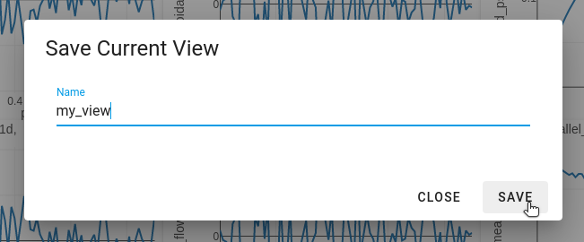
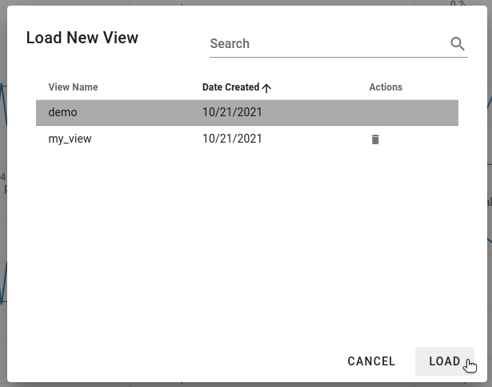

# Creating and Sharing Views

While setting up the dashboard users may find that they have a selection of parameters that they would like to view on many occassions, or that others may find useful to use. The number of rows and columns that they have selected, along with which paremeter they have loaded into each cell can be saved as a `View`. These saved views, along with any others that have been made public by other users, can then be selected from a list and will automatically populate the image gallery.

At the moment all views that are saved are public and available to everyone.

## Saving a View
----------------

To save a view select the middle icon at the bottom of the navigation bar.

You will be prompted to give the view a name. Names must be unique, and the dialog will indicate whether or not your current input is valid. Once it is the `Save` option will be enabled.

## Loading a View
-----------------

To load a predefined view select the first icon at the bottom of the navigation bar.

You will be provided with a table of views that you are able to load. At the top you are able to search by view or creator name, or you can sort the table by the one or more of the columns. If a view is one that you have created there will also be a trash can icon in the `Actions` column to allow you to remove that view if you would like. Once a view has been selected the `Load` option will be enabled and that view can be applied.

