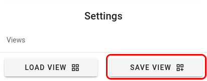

# Creating and Sharing Views

While setting up the dashboard users may find that they have a selection of parameters that they would like to view on many occassions, or that others may find useful to use. The number of rows and columns that they have selected, along with which paremeter they have loaded into each cell can be saved as a `View`. These saved views, along with any others that have been made public by other users, can then be selected from a list and will automatically populate the image gallery.

At the moment all views that are saved are public and available to everyone.

## Saving a View
----------------

To save a view select the middle icon at the bottom of the navigation bar.

You will be prompted to give the view a name and to set the privacy status. Public views will be availbe for any other user to search for and load and private views will only be availble to you. Names must be unique, and the dialog will indicate whether or not your current input is valid. If you enter a view name that you have already used you will be given the option to overwrite the existing view or to cancel and change the name.

## Loading a View
-----------------

To load a predefined view select the first icon at the bottom of the navigation bar.

Once a view has been selected the `Load` option will be enabled and that view can be applied. If a view was created from a different run from the same simulation there will also be the option to load the view as a template. For example, if Simulation_A contains Run_1 and Run_2 and you are currently viewing the parameters fron Run_2, any views created from Run_1 can be loaded as a template. This will attempt to load all of the same parameters at the same time step with the same zoom or log scaling applied. If any of the parameters from the Run_1 view do not exist in Run_2 the cell will simply be left empty.

## Managing Views
-----------------

You will be provided with a table of views that you are able to load. At the very top you are able to toggle between `All Views` and `My Views` in order to quickly filter the table. Within the table itself you are able to search by view or creator name, or you can sort the table by the one or more of the columns. If a view is one that you have created there will also be a trash can icon in the `Actions` column to allow you to delete that view, as well as an icon to allow you to toggle the privacy status of your view. Once a view has been selected the `Load` option will be enabled and that view can be applied.
